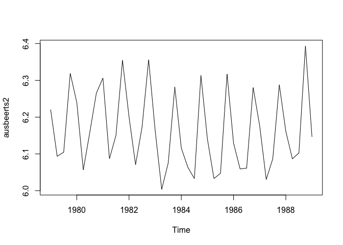
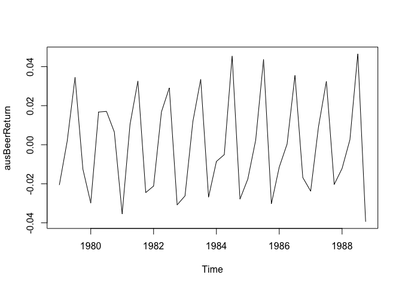

# LectureAssignment
Ramin Farhanian  
July 19, 2017  

# Introduction
 The lecture assignment is about analyzing a typical time series data. We will download the data, calculate the log returns, calculating volatility measure, and calculating volatility for the entire series using three different decay factors.
 
 
# Required Packages
The required packages should be installed once before the rest of the code executes. 

```r
installLibrariesOnDemand <- function (packages)
{
  cat("Installing required libraries on demand:", packages , "\n")
  new.packages <- packages[!(packages %in% installed.packages()[,"Package"])]
  if(length(new.packages)) install.packages(new.packages)
  cat("Missing libraries installation is complete.", "\n")
}
installLibrariesOnDemand(c("tseries", "fpp"))
```

```
## Installing required libraries on demand: tseries fpp 
## Missing libraries installation is complete.
```

```r
library(tseries)
library(fpp)
```

```
## Loading required package: forecast
```

```
## Loading required package: fma
```

```
## Loading required package: expsmooth
```

```
## Loading required package: lmtest
```

```
## Loading required package: zoo
```

```
## 
## Attaching package: 'zoo'
```

```
## The following objects are masked from 'package:base':
## 
##     as.Date, as.Date.numeric
```
 
# Download time series data

```r
ausbeerts <- ts(ausbeer, frequency = 4, start = 1956)
plot(ausbeerts)
```

<!-- -->
# Calculate the log returns

```r
ausbeerLogTs <- log(ausbeerts)
plot(ausbeerLogTs)
```

<!-- -->

```r
ausbeerts2 <- window(ausbeerLogTs, start=1999, end=2009)
```

```
## Warning in window.default(x, ...): 'end' value not changed
```

```r
ts.plot(ausbeerts2)
```

<!-- -->

```r
ausBeerReturn <- log(lag(ausbeerts2)) - log(ausbeerts2)
ts.plot(ausBeerReturn)
```

<!-- -->

# Calculate Volatility measure and volatility measure with a continuous lookback window

```r
ausBeerVol <- sd(ausBeerReturn)*sqrt(40)* 100

Vol <- function(d, logrets) {
    var = 0
    lam = 0
    varlist <- c()
    for(r in logrets) {
      lam = lam * (1- 1/d) + 1
      var = (1- 1/lam)*var + (1/lam)*r^2
      varlist <- c(varlist,var)
    }
    sqrt(varlist)
}
volest <- Vol(10, ausBeerReturn)
volest2 <- Vol(30, ausBeerReturn)
volest3 <- Vol(100, ausBeerReturn)
```

# Plot the results with a volatility curve overlay

```r
ts.plot(volest, gpars=list(ylab="Volatility"))
lines(volest2,  col="red")
lines(volest3,  col="blue")
```

<!-- -->


