# MSDS 6306_Unit 11
Ramin Farhanian  
July 20, 2017  

# Installing required package

```r
installLibrariesOnDemand <- function (packages)
{
  cat("Installing required libraries on demand:", packages , "\n")
  new.packages <- packages[!(packages %in% installed.packages()[,"Package"])]
  if(length(new.packages)) install.packages(new.packages)
  cat("Missing libraries installation is complete.", "\n")
}
installLibrariesOnDemand(c("fpp"))
```

```
## Installing required libraries on demand: fpp 
## Missing libraries installation is complete.
```

```r
library(fpp)
```

```
## Loading required package: forecast
```

```
## Loading required package: fma
```

```
## Loading required package: expsmooth
```

```
## Loading required package: lmtest
```

```
## Loading required package: zoo
```

```
## 
## Attaching package: 'zoo'
```

```
## The following objects are masked from 'package:base':
## 
##     as.Date, as.Date.numeric
```

```
## Loading required package: tseries
```
##Homework

# a)	Plot the time series. Can you identify seasonal fluctuations and/or a trend? Yes, trend can be seen, but is hard to see the seasonal fluctuations. 
 

```r
data(hsales)
str(hsales)
```

```
##  Time-Series [1:275] from 1973 to 1996: 55 60 68 63 65 61 54 52 46 42 ...
```

```r
length(hsales)
```

```
## [1] 275
```

```r
plot(hsales)
```

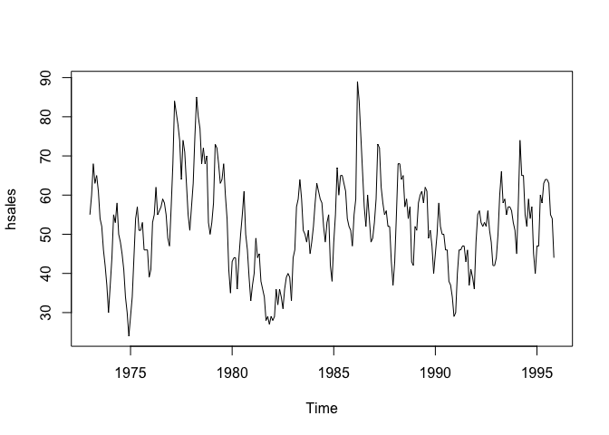<!-- -->

# b)	Use a classical decomposition to calculate the trend-cycle and seasonal indices.


```r
fitd <- decompose(hsales)
plot(fitd)
```

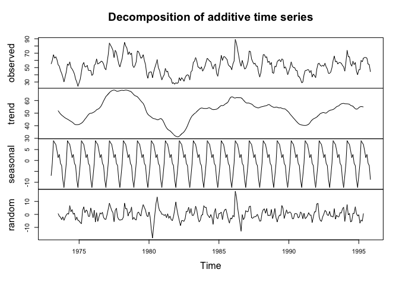<!-- -->

# c)	Do the results support the graphical interpretation from part (a)? Yes, they do; however, seasonal fluctuations is more obvious in this plot.


# d)	Compute and plot the seasonally adjusted data. 


```r
eeadj <- seasadj(fitd)
plot(eeadj)
```

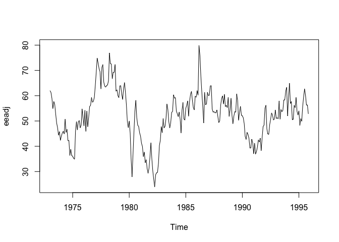<!-- -->

# e)	Change one observation to be an outlier (e.g., add 500 to one observation), and recompute the seasonally adjusted data. What is the effect of the outlier? The outlier has almost no impact on seasonally adjusted data.


```r
hsales2 <- ts(c(hsales[1:136],hsales[137]+250,hsales[138:275]),start=c(1973,1),frequency=12)
plot(hsales2)
```

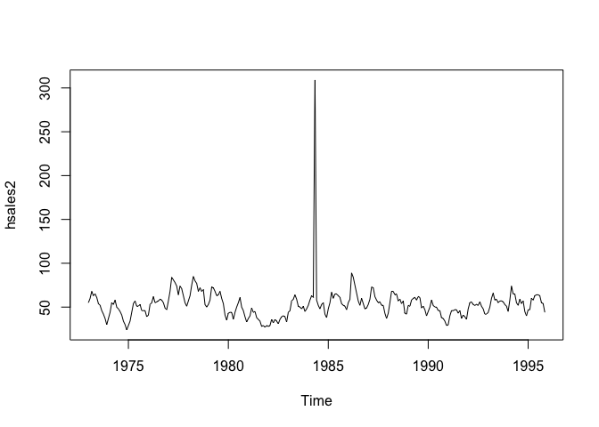<!-- -->

```r
fitd2 <- decompose(hsales2)
plot(fitd2)
```

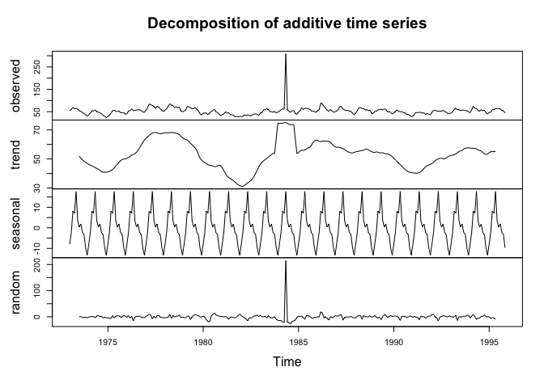<!-- -->

```r
eeadj2 <- seasadj(fitd2)
plot(eeadj2)
```

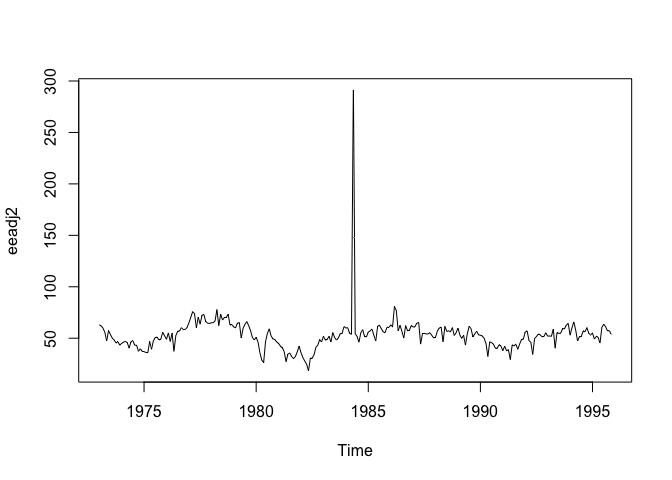<!-- -->


# f)	Does it make any difference if the outlier is near the end rather than in the middle of the time series? No. It almost has no impact on seasonal fluctuations.


```r
hsales3 <- ts(c(hsales[1:269],hsales[270]+500,hsales[271:275]),start=c(1973,1),frequency=12)
plot(hsales3)
```

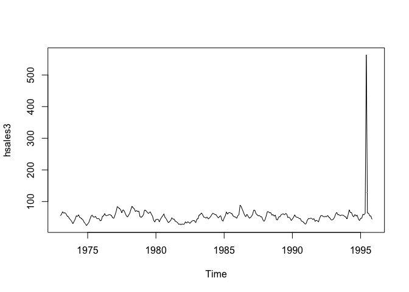<!-- -->

```r
fitd3 <- decompose(hsales3)
plot(fitd3)
```

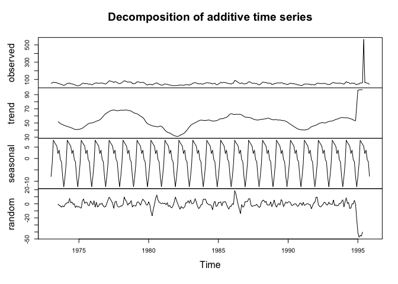<!-- -->

```r
eeadj3 <- seasadj(fitd3)
plot(eeadj3)
```

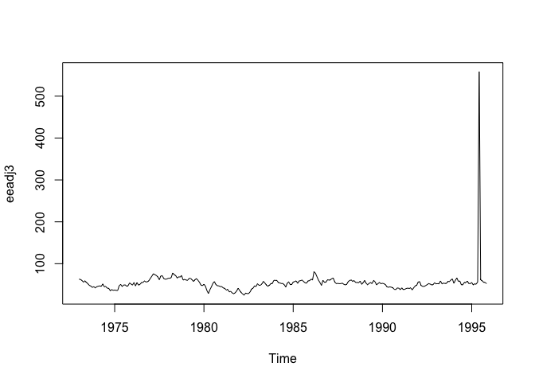<!-- -->


```r
hsales2 <- ts(c(hsales[1:136],hsales[137]+500,hsales[138:275]),start=c(1973,1),frequency=12)
plot(hsales2)
```

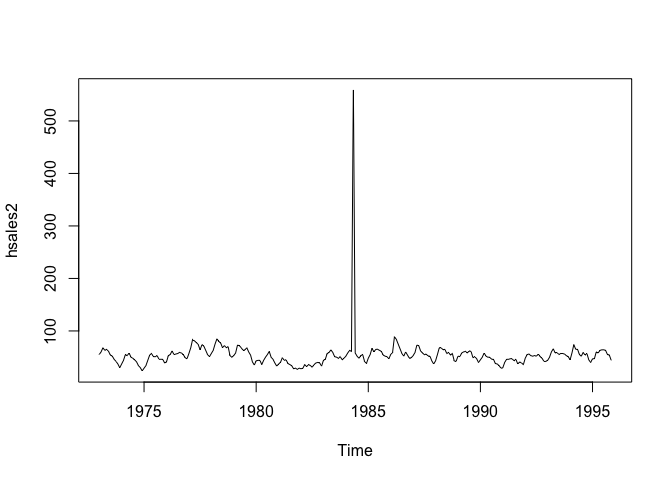<!-- -->

# g)	Use STL to decompose the series.


```r
fit <- stl(hsales, s.window=5)
plot(fit)
```

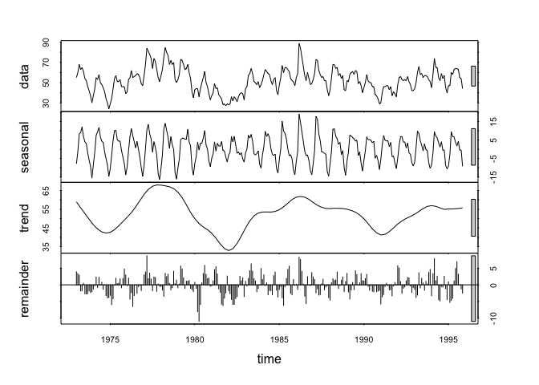<!-- -->

```r
fit2 <- stl(hsales2, s.window=5)
plot(fit2)
```

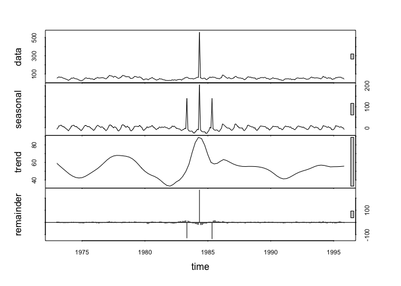<!-- -->

```r
fit3 <- stl(hsales3, s.window=5)
plot(fit3)
```

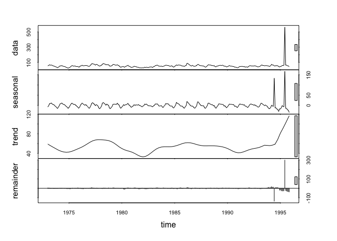<!-- -->

